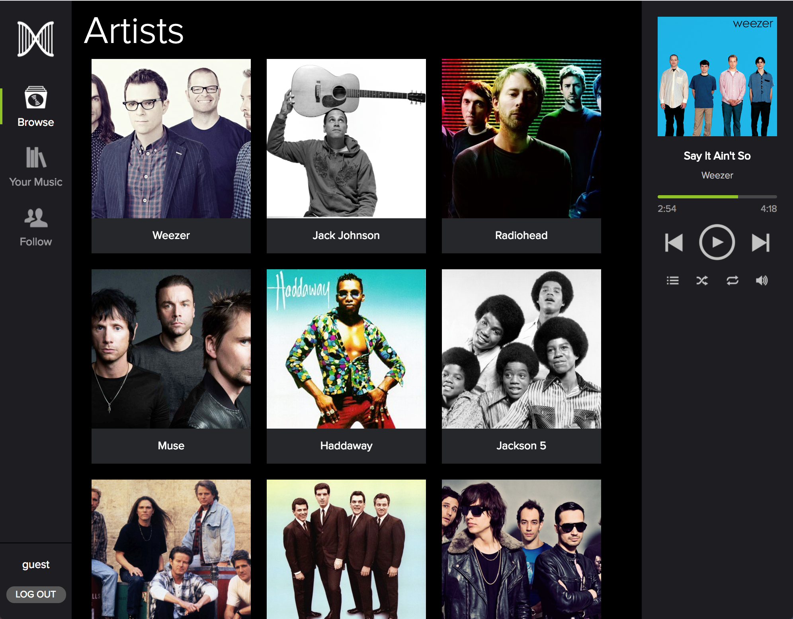

# Clonify

[Clonify live][heroku]

[heroku]: http://www.clonifyapp.com

Clonify is a full-stack web application inspired by Spotify's web player built with Ruby on Rails and React/Redux.



## Features

 - User login and sign-up
 - Browsing artists, albums, and songs
 - Continuous song playback while navigating site
 - Creating, updating, viewing, and deleting playlists
 - Adding/removing songs from playlists

## Implementation

### Audio and Image Hosting

Image and audio files are attached to the `Artist`, `Album`, and `Song` models via the [paperclip][paperclip] gem. The attachments are hosted on Amazon S3, with the AWS keys protected using [figaro][figaro].

[paperclip]: https://github.com/thoughtbot/paperclip
[figaro]: https://github.com/laserlemon/figaro

### Song Playback

Audio playback is accomplished with the `<audio>` HTML5 element. Clonify supports continuous song playback during site navigation by including the `<AudioPlayer>` component, which contains the `<audio>` element, as a child within the main `<App>` component. This means that the `<AudioPlayer>` is present on all of the view--it is just hidden when not active.

### Playlist CRUD

Playlists are created, retrieved, edited, and deleted via RESTful API endpoints. A `playlist_listings` join table is used to satisfy the many-to-many relationship between `songs` and `playlists`. Adding or removing a song from a playlist simply translates to creating or deleting a row in the `playlist_listings` table.

#### Authorization

In order to prevent users from updating or deleting playlists that don't belong to them (via [Postman][postman] or any other means of sending out `PATCH` or `POST` requests to the Rails API), the `PlaylistsController` provides a callback to a `before_filter` that ensures that only the playlists belonging to the currently logged-in user can be updated or destroyed:

```ruby
# app/controllers/api/playlists_controller.rb

before_filter :require_authorization, only: [:update, :destroy]

...

def require_authorization
  if current_user != Playlist.find(params[:id]).owner
    message = "You do not have permission to edit or delete this playlist!"
    render json: message, status: 403
  end
end
```

[postman]: https://github.com/postmanlabs/postman-app-support

## Future Work

- [ ] Play Queue with shuffle and repeat
- [ ] Search songs, artists, albums, and playlists
- [ ] Playlist and User Following
